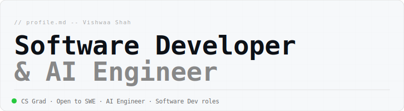
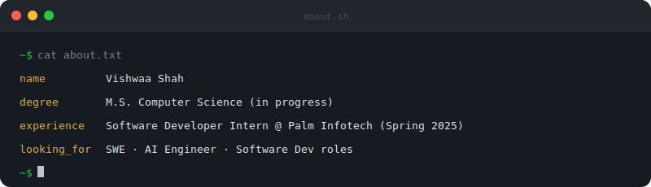

 

 

 

## 🛠️ Tech Stack

**Languages**

**AI / ML**

**Software Engineering**

**Tooling**

---

## 🚀 Featured Projects

| Tag | Project | Description | Stack |
|---|---|---|---|
| `AI` | [🔬 Breast Cancer Diagnosis](https://github.com/Vswashah/breast-cancer-diagnosis) | AI classifier distinguishing malignant vs benign tumors from clinical feature data | Python, scikit-learn, Pandas |
| `AI` | [🏠 House Price Prediction](https://github.com/Vswashah/house-price-prediction-model) | Regression model using Linear Regression & Random Forest to predict housing prices | Python, scikit-learn, Jupyter |
| `SWE` | [☕ Coffee Shop Website](https://github.com/Vswashah/coffee-shop-menu-website) | Responsive menu website for a coffee shop | HTML, CSS |
| `SWE` | [📈 JPMC SWE Task](https://github.com/Vswashah/forage-jpmc-swe-task-1) | J.P. Morgan virtual experience — data feed manipulation and real-time visualization | Python, React |

---

## 📊 GitHub Stats

  
  

  

---

  
  &nbsp;·&nbsp;
  <b>Open to opportunities</b> — shahvswa07@gmail.com

---

## 🚀 Featured Projects

| Tag | Project | Description | Stack |
|---|---|---|---|
| `AI` | [🔬 Breast Cancer Diagnosis](https://github.com/Vswashah/breast-cancer-diagnosis) | AI classifier distinguishing malignant vs benign tumors from clinical feature data | Python, scikit-learn, Pandas |
| `AI` | [🏠 House Price Prediction](https://github.com/Vswashah/house-price-prediction-model) | Regression model using Linear Regression & Random Forest to predict housing prices | Python, scikit-learn, Jupyter |
| `SWE` | [☕ Coffee Shop Website](https://github.com/Vswashah/coffee-shop-menu-website) | Responsive menu website for a coffee shop | HTML, CSS |
| `SWE` | [📈 JPMC SWE Task](https://github.com/Vswashah/forage-jpmc-swe-task-1) | J.P. Morgan virtual experience — data feed manipulation and real-time visualization | Python, React |

---

## 📊 GitHub Stats

  
  

  

---

  
  &nbsp;·&nbsp;
  <b>Open to opportunities</b> — shahvswa07@gmail.com

